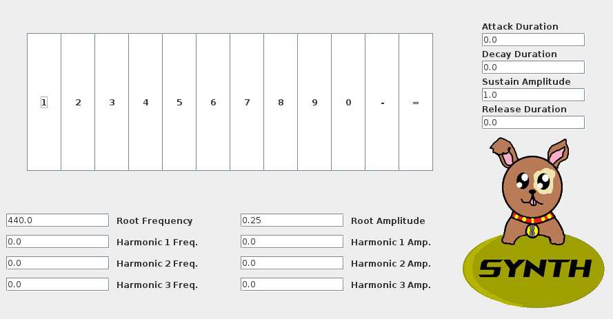

# Synth
Simple GUI driven sound synthesizer written in Java. Uses Java Swing for interaction, and a multithreaded custom virtual oscillator to produce tones.

GUI features fields for manipulating parameters of a virtual ADSR envelope and creating a custom harmonics, and a virtual keyboard for playing different tones.

Program was submitted as a final project for Mercer County Community College COS210 (Data Structures) in a team of 4 led by myself.

# Usage
Example of running program:

ADSR envelope and harmonics can be manipulated in real time, and tones can be played either by clicking on the GUI keys, or by using the prescribed keys. Numerical fields support scrolling to change value.
